
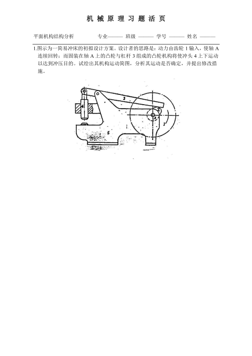

answer

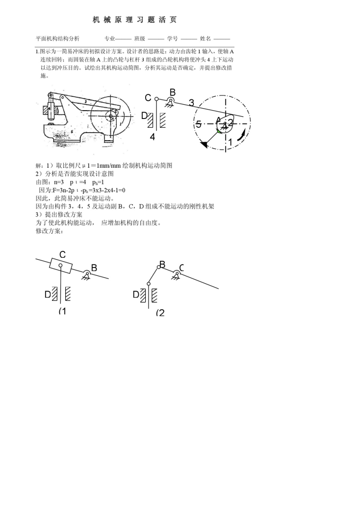

**summary**:

1. 画图要注意比例尺
2. 根据原图来画运动简图，就不需要过于追求画等价变形的形式
3. 学会根据结果来分析，知道是自由度不够所以从增加自由度来解决问题

我的设计如下：

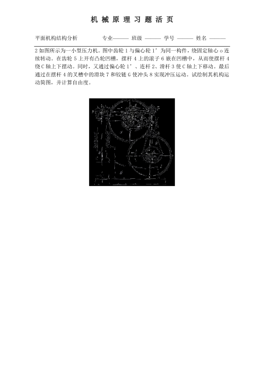

answer

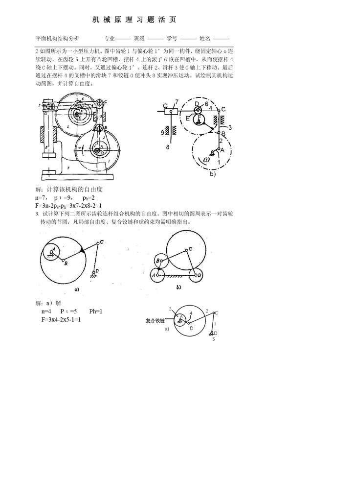

**notice**:

1. 有滚子的一般是偏心的，所以 F 处应该是偏心的
2. 7 处是一个滑块结构，容易忽略，以为仅仅是一个转动副

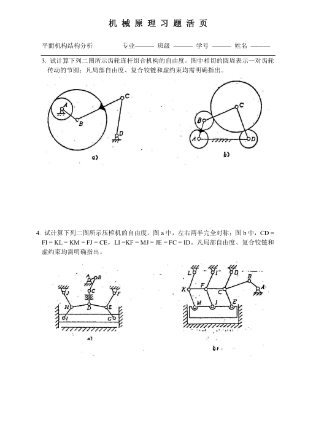

answer

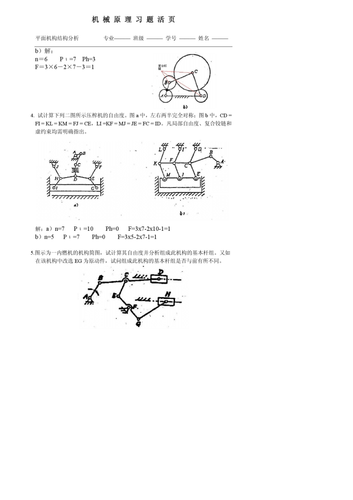

**summary**:

1. 采取去除约束的方法，按照一般的计算
2. 也可参照课本，计算虚约束

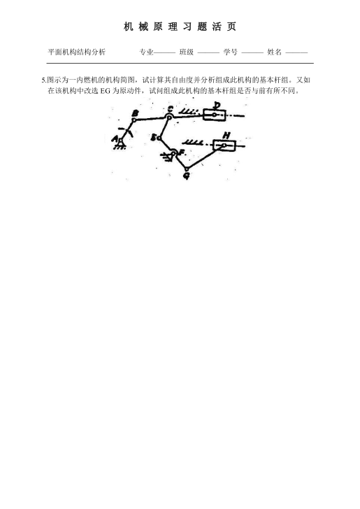

answer

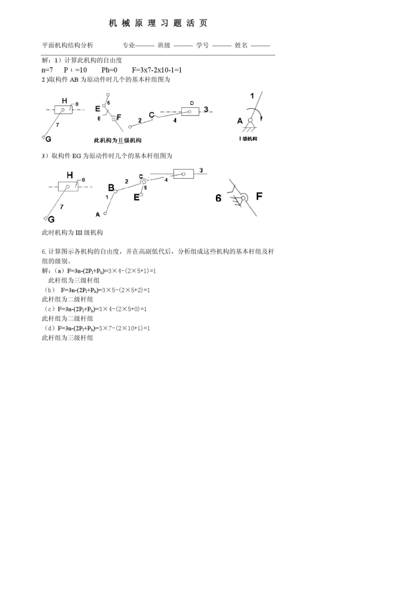

**summary**:

1. 从远离原动件开始拆分
2. 拆分后保持自由度不变
3. 运动副是跟随杆组的

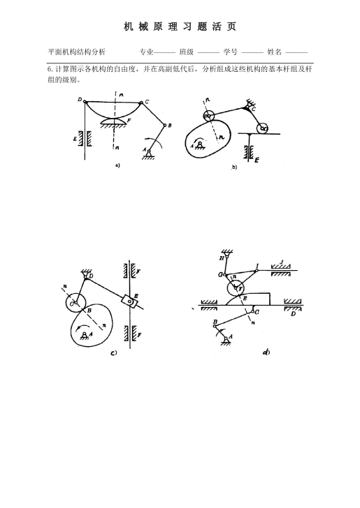

answer

题目 1

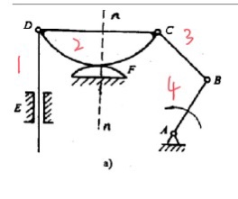

n = 4; PL = 5; PH = 1 => F = 1

**高副低代**:

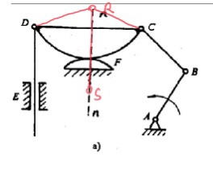

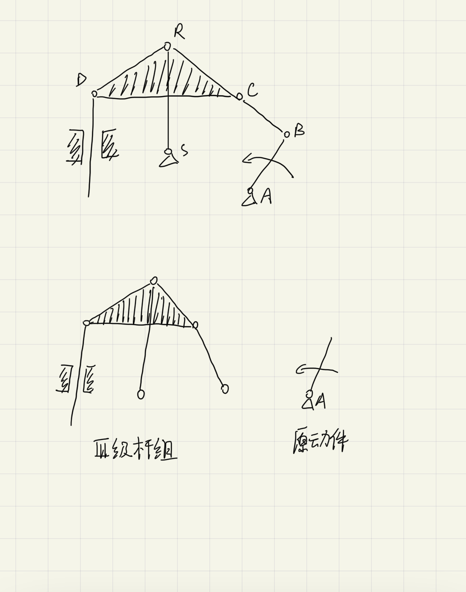

**notice**:

1. DRC 构成一个三角形，所以是一个整体，用阴影描述更为醒目

题目 2

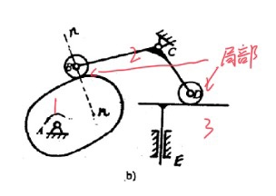

局部自由度的滚子可以不用计算到 n 里面

n = 3; PL = 3; PH = 2 => F = 1

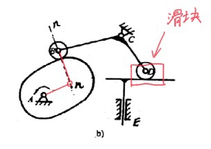

高副低代，

1. 将滚子固结
2. 找到对应的曲率半径，一个变成了转动副，一个曲率半径无穷大变成了移动副

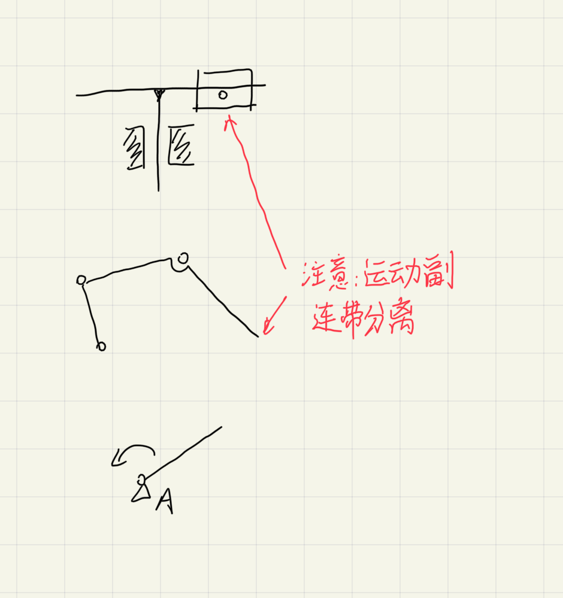

题目 3，类似

题目 4

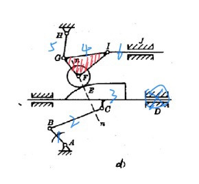

n = 6; PL = 8; PH = 1 => F = 1

高副低代

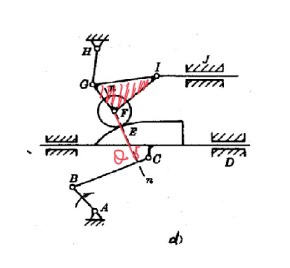

F 是与 CE 接触的，所以高副低代后的 Q 是固结在 CE 上面的

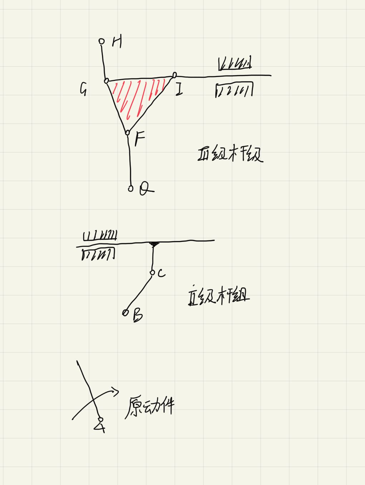

**summary**:

1. 找出局部自由度，虚约束，复合铰链，以便提醒自己
2. 看看是否有三角形，如果有，则画上阴影表示一个整体
3. 高副低代，滚子的核心是考虑曲率半径

