
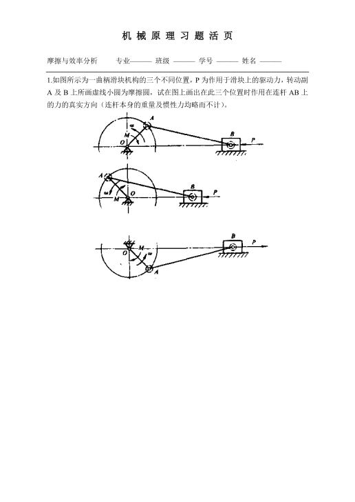

answer

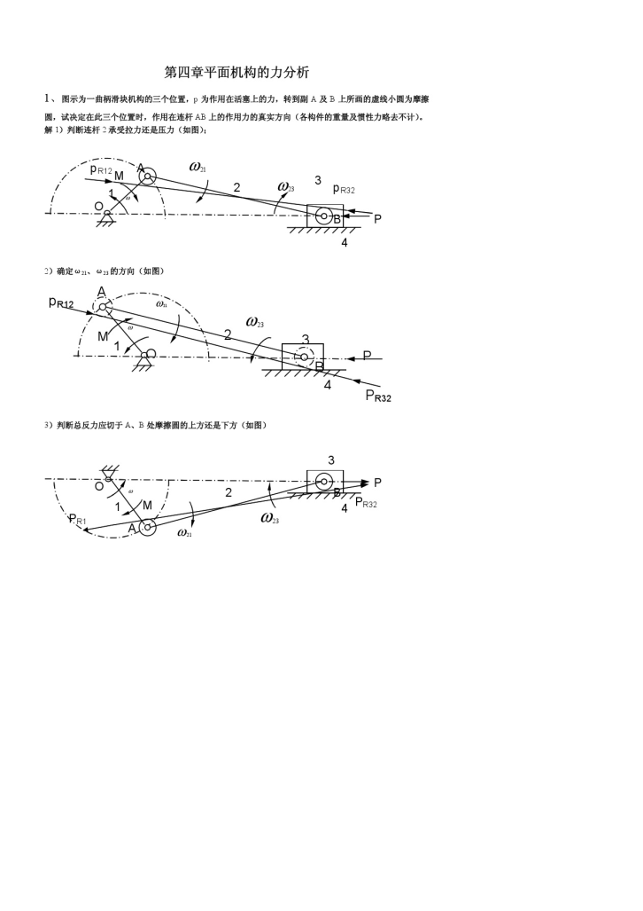

**summary**:

1. 假设无摩擦，考虑连杆是受压还是受拉
2. 观察连杆相对参考杆是什么方向旋转，则参考杆给连杆的力则是旋转的阻力
3. 通过二力杆分析，做两摩擦圆的公切线

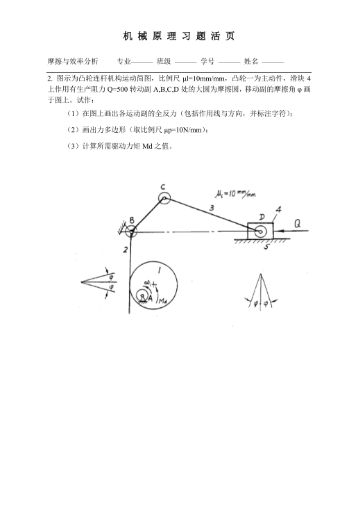

answer

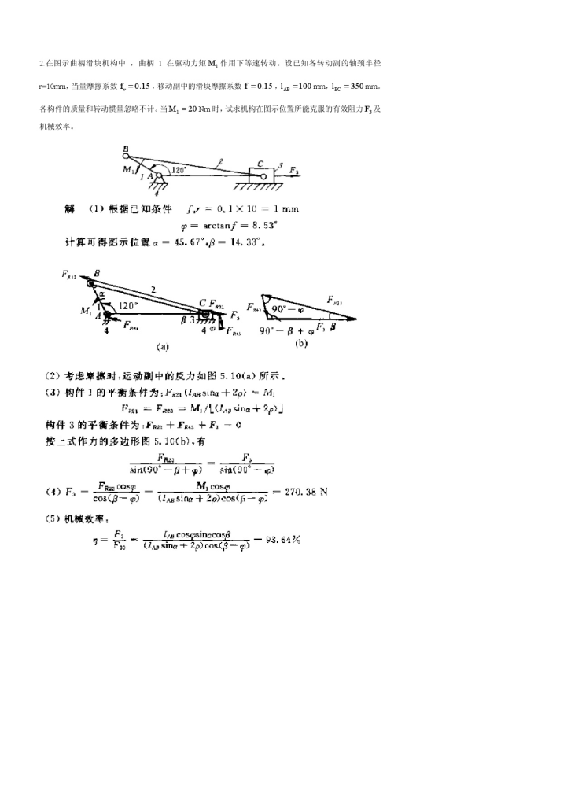

觉得答案挺混乱，挺拉跨的

- 找二力杆做突破口

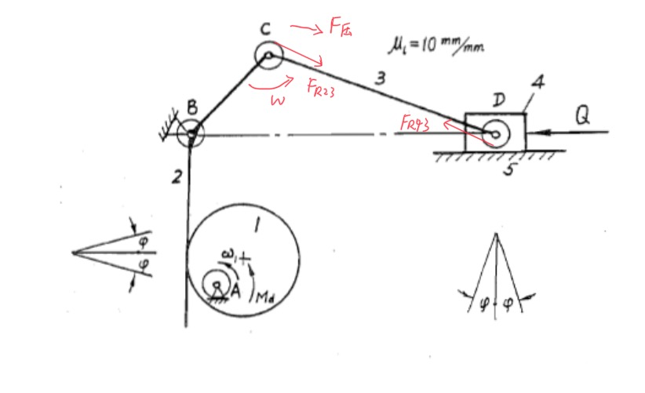

> 仍然
>
> 1. 受压还是受拉
> 2. 旋转方向

- 分析右边

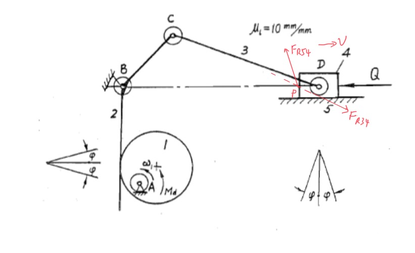

> 利用好三力汇交
>
> 1. Fr34 与 Q 交于 P
> 2. Fr54 必须经过 P
> 3. 4 相对 5 向右，则 Fr54 为左上方向，根据摩擦角画出即可

- 分析左边

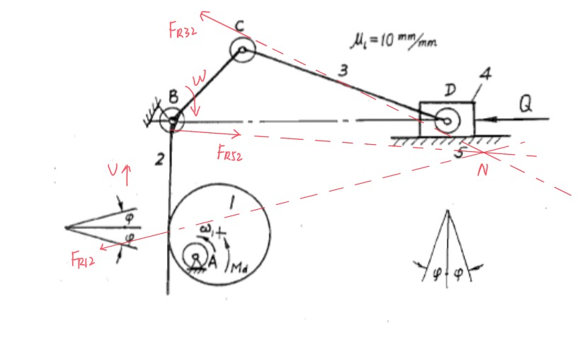

> 1. 2 相对 1 向上运动，则 Fr12 为左下
> 2. Fr12 与 Fr32 相交于 N
> 3. Fr52 过点 N ，且由于三力汇交，知道 Fr52 方向 **向左**
> 4. 通过 2 相对 5 的旋转方向和 Fr52 的方向，知道 Fr52 相切于摩擦圆的下面

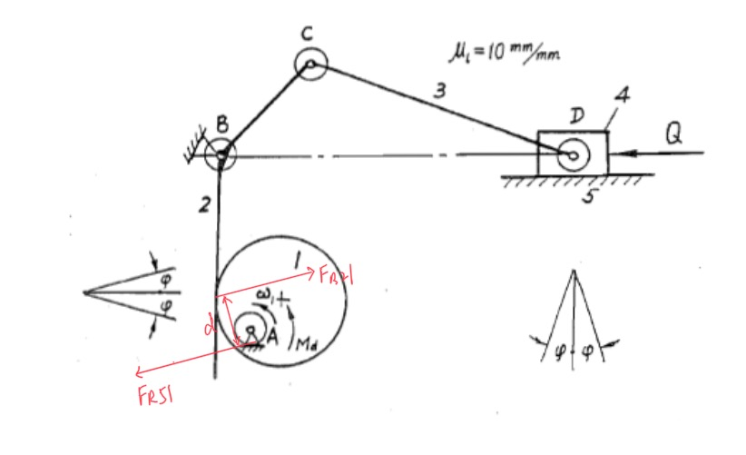

> 注意点 A 出也有 **摩擦圆**
>
> 注意 **比例尺**

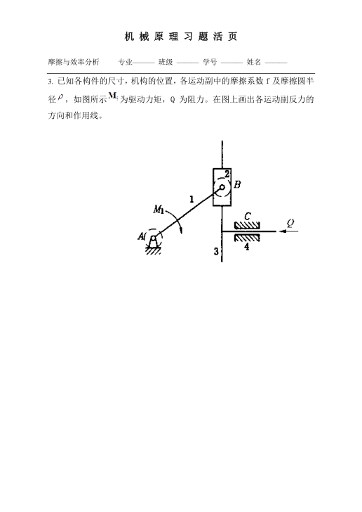

answer

1. 考虑二力杆

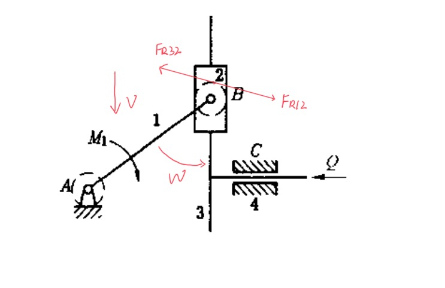

> 滑块 2 是二力构件
>
> 通过 f 可以求出摩擦角 φ
>
> 2 相对 3 的运动是右下，则 Fr32 的方向是 左上
>
> 因而知道 Fr12 的方向是右下
>
> 再根据 2 相对 1 的运动 w ，结合摩擦角可得一对力的具体位置

2. 左边部分

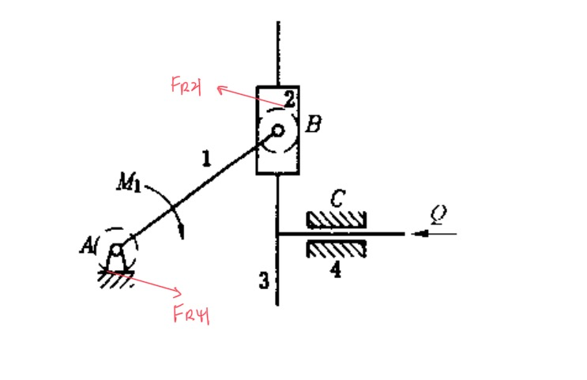

> 发现根据 M 与 全反力 **相反** ,可以判断 Fr21 的基本方向
>
> 因而可以推出 Fr12

3. 右边部分

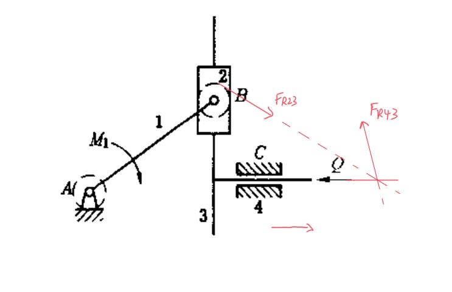

> Fr32 与 Q 相交
>
> 全反力经过交点
>
> 3 相对 4 向右
>
> 故可以推出全反力

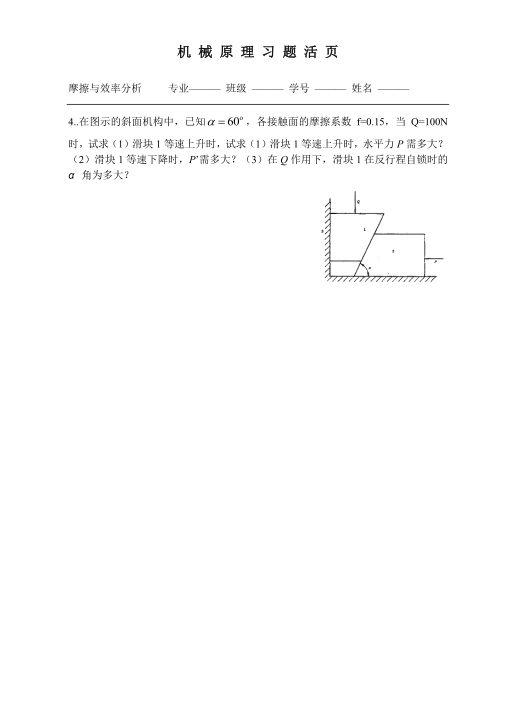

answer

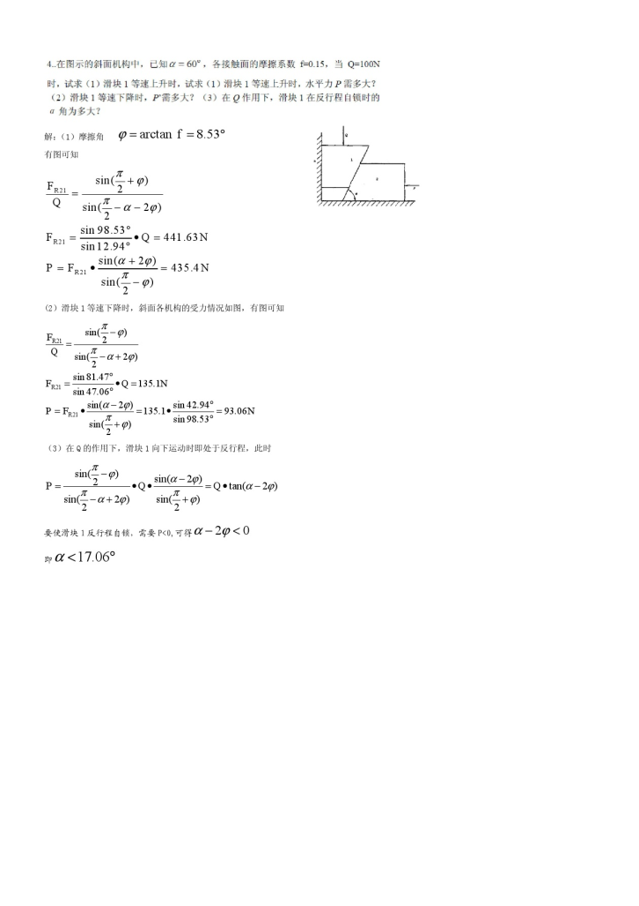

觉得挺有用的是 **正弦关系**

