
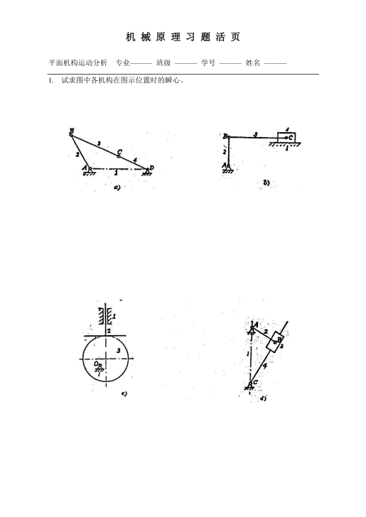

answer

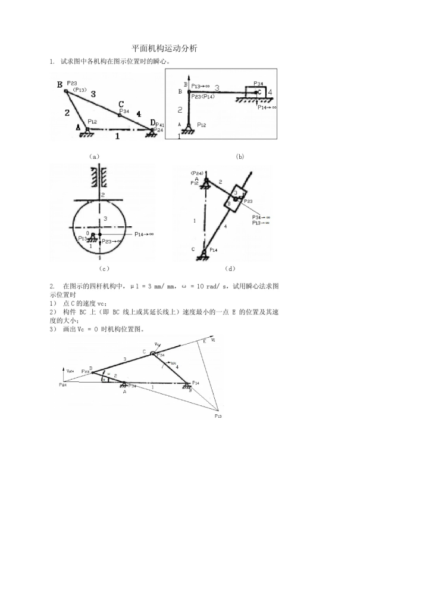

**notice**:

1. 需要注意的是凸轮机构：

> 凸轮与滑杆同时向上运动，由于凸轮不可能压入滑杆中，所以凸轮相对滑杆只能做水平运动
>
> 由于瞬心垂直速度方向，所以瞬心垂直于水平方向
>
> 也就是除了三心定理，瞬心可以通过速度方向判定

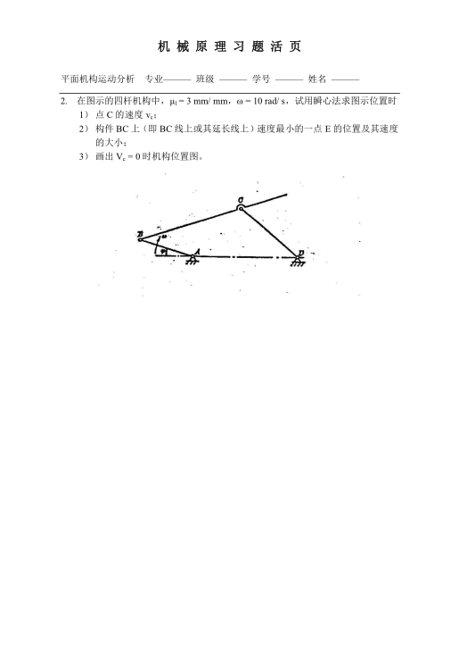

answer

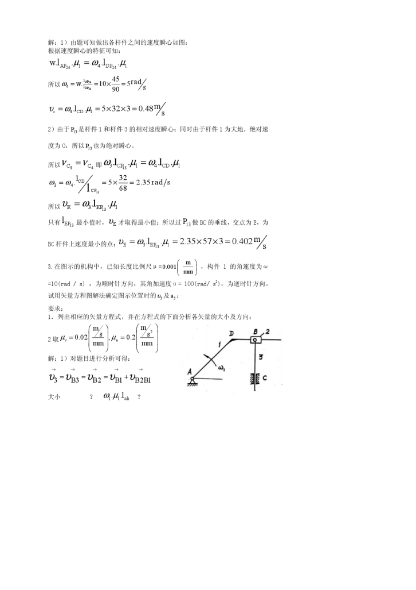

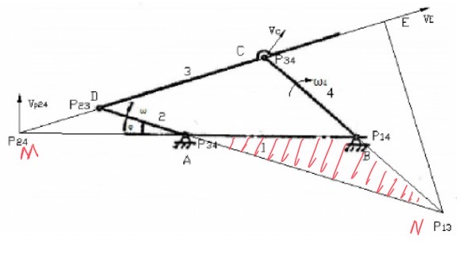

比较有趣，解决第一问有两种角度

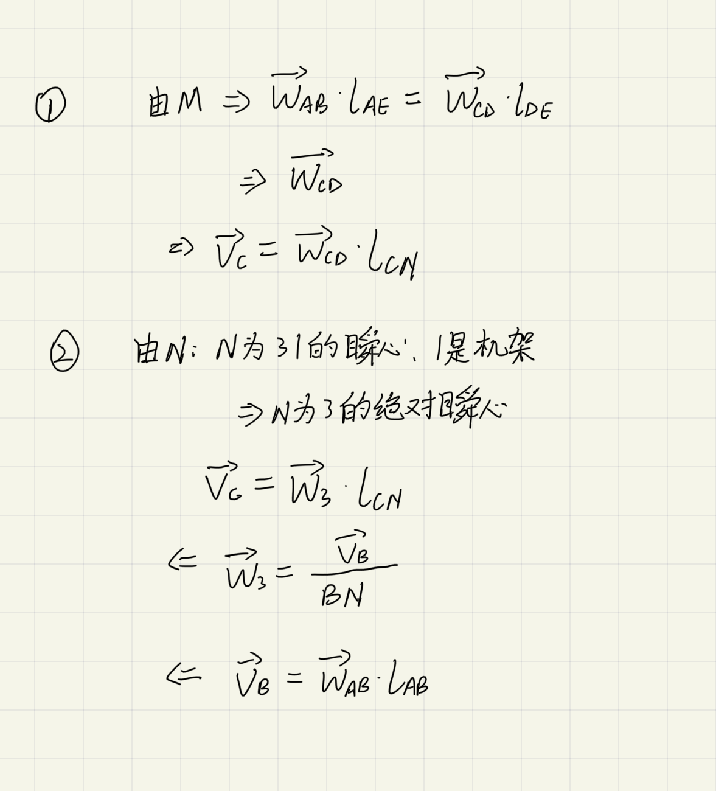

两个等式相等，恰好是 **梅涅劳斯定理**

第 3 问：

由方法 1 知道，Vc = 0 等价于 AM = 0 或者 AM = 常数 DM = 无穷 (后者不成立)

于是等价于 AM = 0 等价于 A, B, C 共线

画图即可

修正第 3 题是逆时针转动

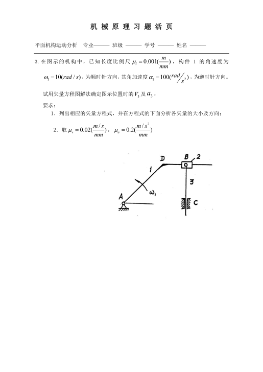

answer

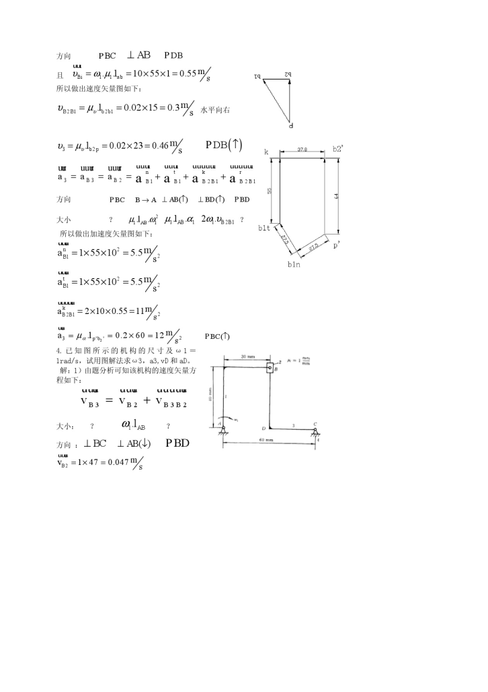

**summary**:

1. 灵活运用扩大构件的想法，思考 **动点** 和 **牵连点**
2. 列方程的时候可以在下面写方向和已知大小

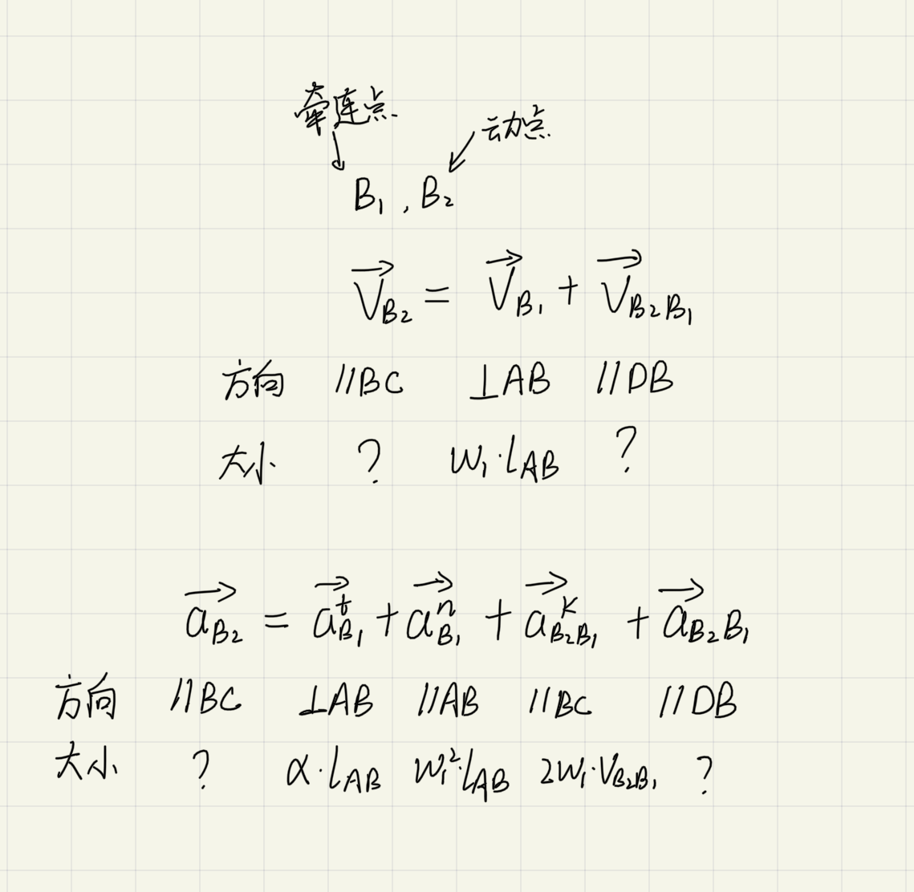

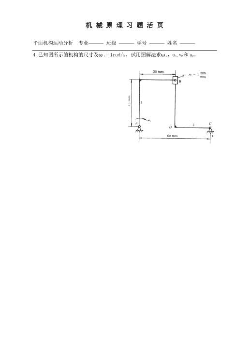

answer

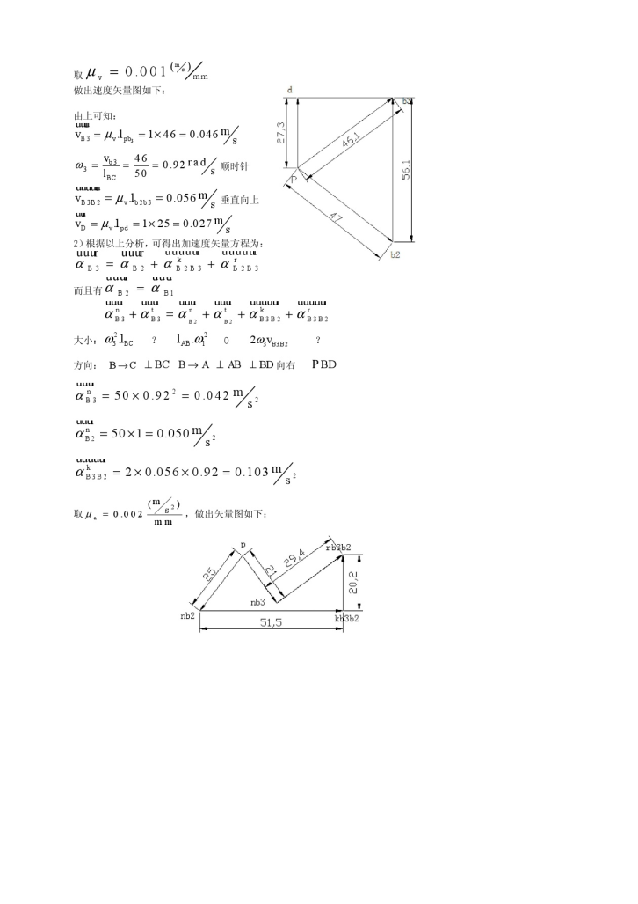

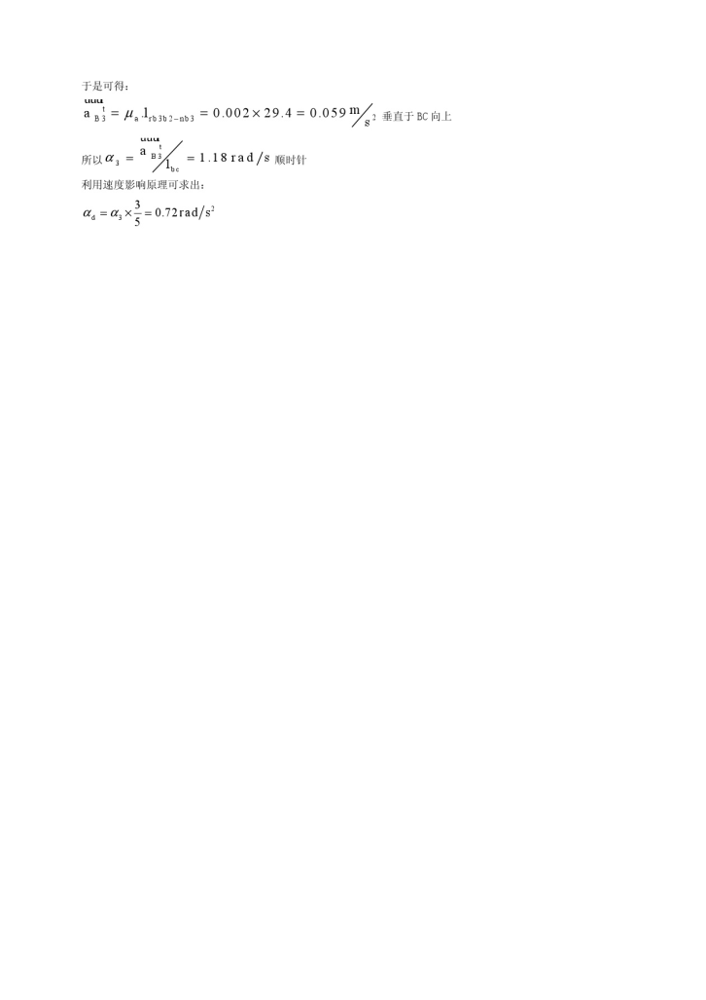

有两种不同的角度，

1. 从原动件出发，以 2 做参考系，

> 需要注意的是，考虑科氏加速度时，角速度应该是参考系的速度
>
> 而参考系是 2，又因为 2 和 3 的相对运动是滑动，所以 2 的角速度和 3 相等
>
> 所以用的是 3 的角速度

2. 从运动的习惯上思考，用 3 做参考系

> 这避免了参考系角速度关系不明确的的问题
>
> 而且，一般考虑相对运动也习惯从 3 理解到 2

