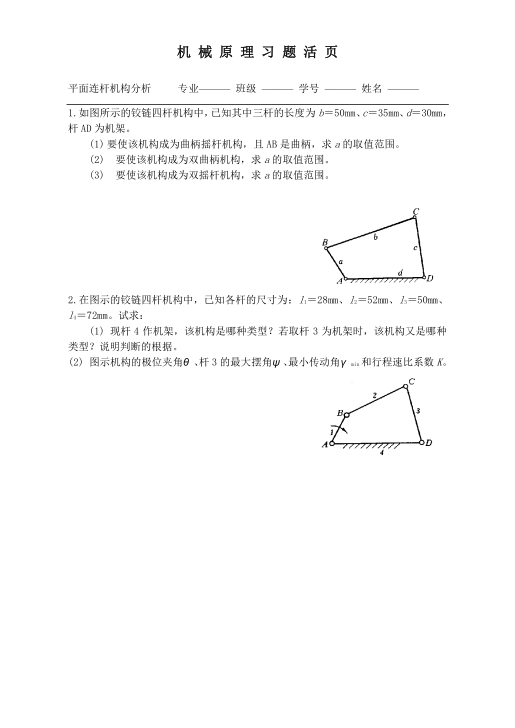
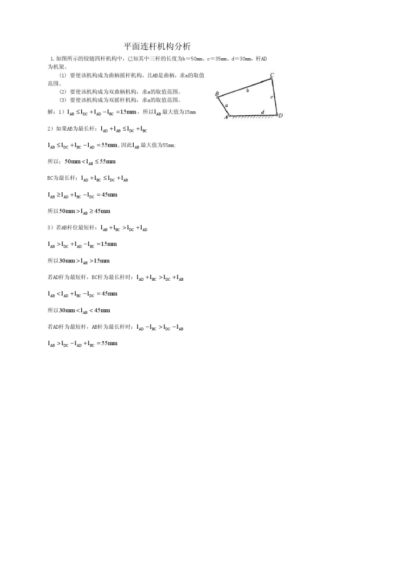
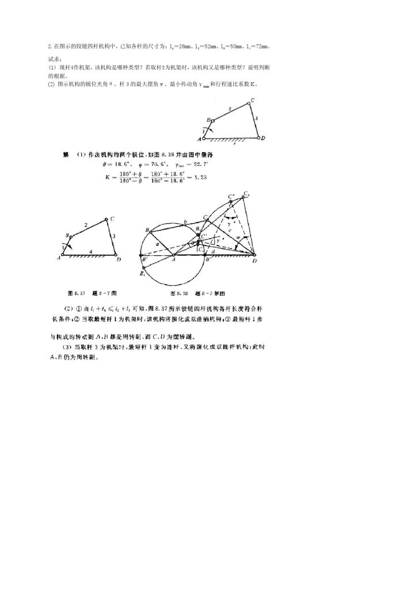
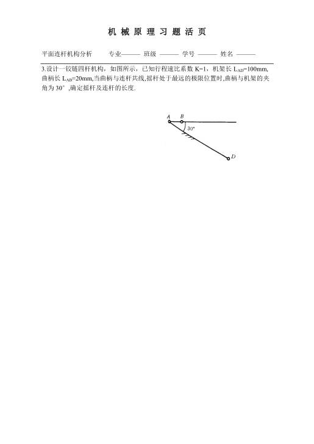
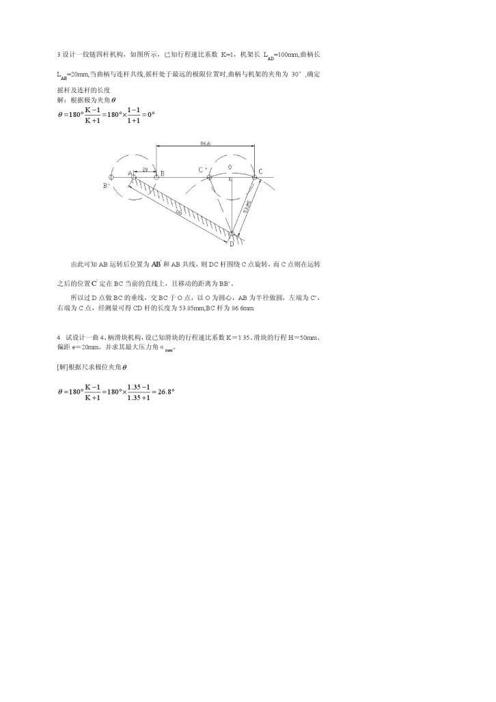
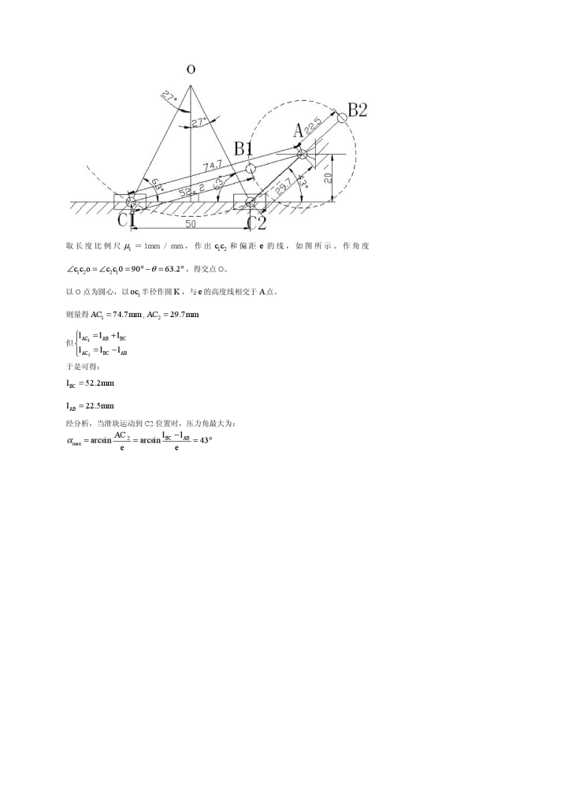

answer

1. 曲柄摇杆

> a 或者 c 为最短杆
>
> 由题目关系知道，a 为最短杆
>
> a + b <= c + d
>
> => 0 < a <= 15

2. 双曲柄

> d 为最短杆
>
> => d <= a
>
> => a >= 30
>
> if b is the longest
>
> then a <= b
>
> => a <=50
>
> according to d + b <= a + c
>
> => a >= 45
>
> => 45 <= a <= 50
>
> if a is the longest
>
> then a >= b
>
> => a >= 50
>
> according to d + a <= b + c
>
> => a <=55
>
> => 50 <= a <=55
>
> so, 45 <= a <= 55

3. 双摇杆

> 1. b is the shortest, but it's impossible
> 2. 不满足杆长公式
>
> 采用补集的思想
>
> 四边形机构有边长约束
>
> 0 < a < b + c + d = 115
>
> 1. 曲柄摇杆
>    > AB 为曲柄 (0 < a < 15),
>    >
>    > CD 为曲柄 (不存在)
> 2. 双曲柄 (45 <= a <= 55)
> 3. 剩下的区间为双摇杆
>    > 15 < a < 15 或者 55 < a < 115

**summary**:

1. 需要判断是否满足杆长公式，如果不满足，则一定为双摇杆

answer

answer

